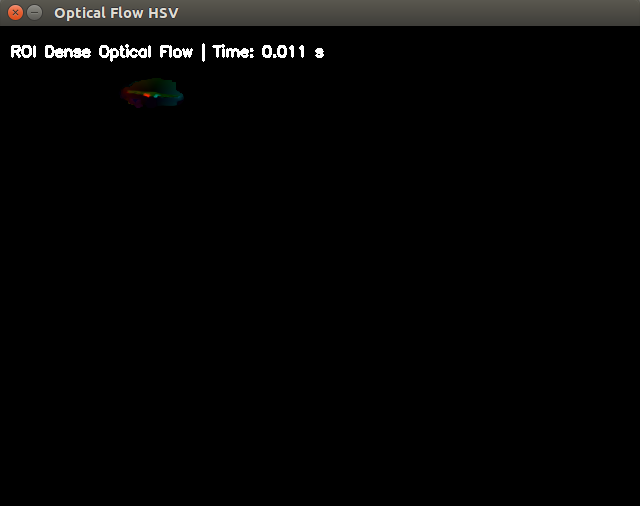
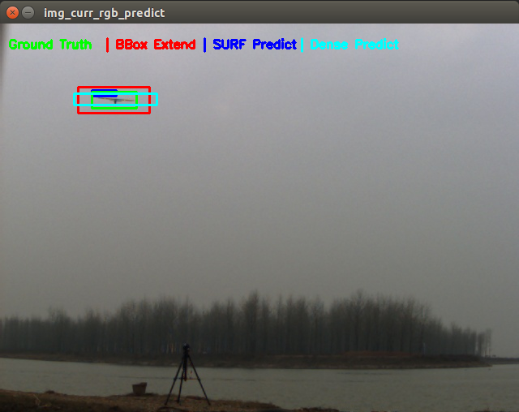
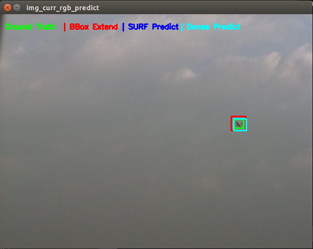
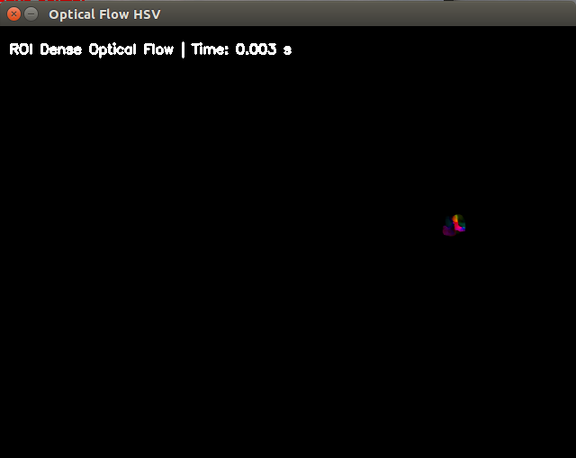

# System Requirement
- Ubuntu 14.04.5
- Python 2.7.12 (Using Anconda 4.2.9)
- Opencv 2.4.11

# File Details
`opticalflow_original.py`
- Show optical flow results of the input images
- `cv2.CalcOpticalFlowHS`
- `cv2.CalcOpticalFlowLK`

`opticalflow\_whole\_img.py`
- Show optical flow results of the input images
- SURF feature based `cv2.calcOpticalFlowPyrLK`
- `cv2.calcOpticalFlowFarneback`
- `cv.calcOpticalFlowFarneback`

`opticalflow_roi.py`
- Show optical flow results of the manually selected ROI region of the input images
- `cv2.calcOpticalFlowFarneback`
- `cv.calcOpticalFlowFarneback`

`opticalflow_image_sequence.py`
- Show optical flow result based on the related two frames
- The region for implement optical flow could be selected 
	- Bouding Box Ground Truth based on previous image
	- SURF Points Results
	- Dense Flow Results
- `cv2.calcOpticalFlowFarneback`
- `cv.calcOpticalFlowFarneback`
- 
- 
- 
- 

